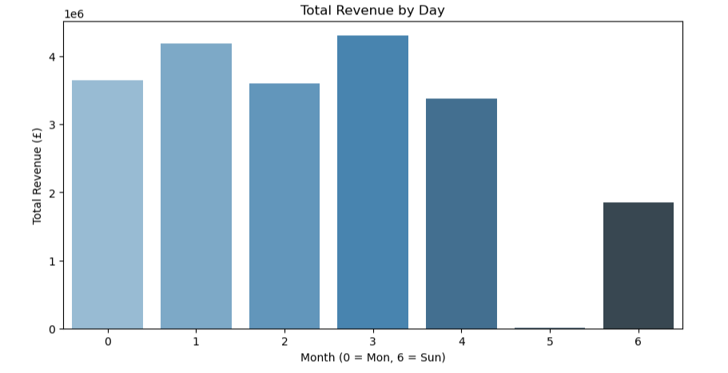
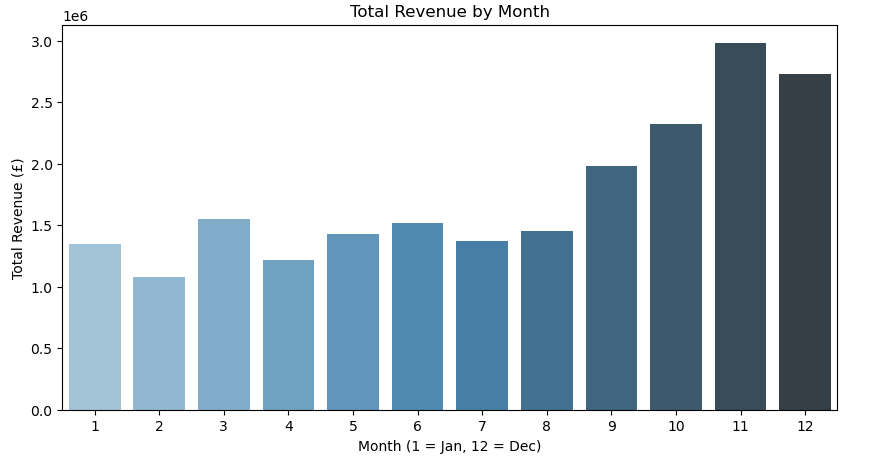
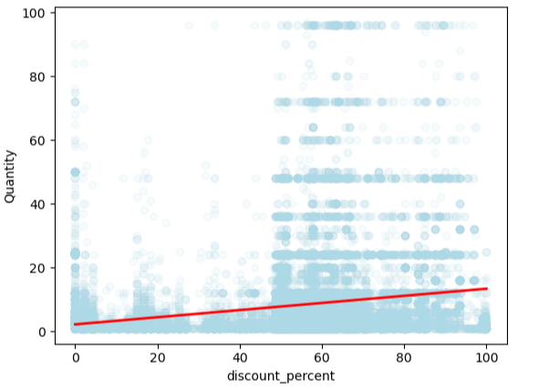
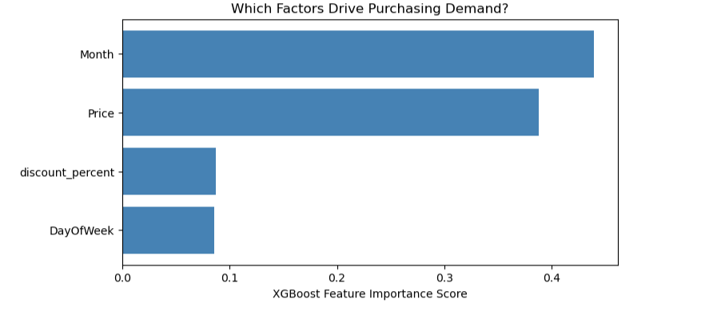

# B2B Wholesale Price Elasticity & Revenue Optimization

## 1. Project Introduction & Business Context

### What Is This Project?
This project is an end-to-end data analytics and machine learning lab designed to analyse customer purchasing behaviour for a B2B wholesale operation. It combines SQL-driven Exploratory Data Analysis (EDA) with Machine Learning (XGBoost Regressor) to predict sales volume and optimise pricing strategies.

### Why Build It & Why Is It Useful?
In the wholesale retail sector, setting unit prices and discount levels blindly risks leaving substantial revenue on the table. Setting prices too high drives buyers to competitors, while pricing too low reduces profit margins without generating enough additional volume. By modelling historical transaction data, this project transforms raw order logs into a predictive decision-making tool.

### Primary Research Question
> *"If the unit price or discount percentage increases or decreases on a given item, how will customer demand (unit sales) respond based on historical buying patterns?"*

---

## 2. Technical Process & Pipeline Summary

The project followed a 4-phase analytical pipeline:

```text
Data Cleaning & Filtering (SQL / Pandas)
  └── Handled missing customer IDs, removed return transactions, formatted timestamps

Exploratory Data Analysis (SQL & Visualisation)
  └── Uncovered operational schedules (6-day B2B week) and Q4 demand seasonality

Predictive Machine Learning (XGBoost)
  └── Engineered X (features) & y (Quantity), performed 80/20 train/test split, fitted model

Prescriptive Scenario Simulation
  └── Tested custom "What-If" pricing inputs to forecast demand and expected revenue
```

## Modelling Setup: Features vs. Target

To predict customer buying behaviour, the target variable and features were defined as:

* **Target Variable ($y$):** `Quantity` (Demand) — Volume is the direct human response to price shifts.
* **Feature Matrix ($X$):** `['Price', 'discount_percent', 'Month', 'DayOfWeek']` — The operational and commercial factors influencing the customer's buying decision.

---

## 3. Key Findings & Data Insights

### Operational Schedule: The B2B Signature
During EDA, analysing order counts across `DayOfWeek` revealed zero transactions recorded on Saturdays (`DayOfWeek = 5`).

* **Business Model Deduction:** The company operates on a 6-day B2B schedule. Warehouses and sales offices close on Saturdays.
* **Weekly Rhythm:** Order activity peaks mid-week (Monday through Thursday) as corporate buyers and store managers stock inventory, with pre-orders picking up on Sunday.

### Demand Seasonality
Analysis revealed heavy seasonality, peaking during Q4 (November at ~£2.98M) as commercial clients prepare for peak retail holiday demand.

### Price Elasticity & Regression Trends
Scatter plots and regression trendlines demonstrated an upward-sloping demand relationship between discount percentages and quantity sold, confirming that B2B clients respond directly to price incentives by purchasing larger bulk quantities.

---

## 4. Technical Challenges & Industry Solutions

### Problem: Slow Graph Rendering on Large Datasets
* **The Issue:** Attempting to render scatter plots and regression trendlines (`sns.regplot`) across more than 1 million raw transaction rows caused the Jupyter Notebook kernel to lag and take excessive time to render.
* **The Industry Solution:** Implemented **Randomised Subsampling**. By extracting a representative random sample of 50,000 rows (`clean_data_df.sample(n=50000, random_state=42)`), plot rendering speed improved from tens of seconds to under two seconds while preserving 100% of the statistical distribution and regression trends.

---

## 5. Gallery of Visualisations

| Chart Title | Visual Description / Location | Key Insight Rendered |
| :--- | :--- | :--- |
| **Weekly Order Volume** |  | Proves 0 Saturday orders; identifies mid-week B2B ordering peaks. |
| **Monthly Revenue Trend** |  | Highlights Q4 demand surge (November peak). |
| **Price Elasticity Scatter** |  | Visualises the relationship between `discount_percent` and `Quantity`. |
| **Feature Importance** |  | Shows `Month` and `Price` as primary drivers of customer demand. |

---

## 6. Model Results & Prescriptive Takeaways

### Model Performance
* The initial XGBoost Regressor achieved an $R^2$ score of **0.2941** (~29.4%).
* In raw, unaggregated transaction logs, this is standard due to unobserved factors (such as client company size or custom negotiated contracts).
* Feature importance analysis confirmed that `Month` (Seasonality) and `Price` (Base Unit Cost) are the primary factors driving sales volume.

### Prescriptive Scenario Test
To demonstrate practical commercial application, the trained model was evaluated on a sample B2B transaction scenario:

* **Inputs:** `Price` = £10.00, `discount_percent` = 10.0%, `Month` = 11 (November), `DayOfWeek` = 2 (Wednesday).
* **Model Prediction:** ~2.3 units sold per transaction.
* **Expected Revenue Calculation:**

$$\text{Expected Revenue} = \text{Predicted Quantity} \times \text{Discounted Unit Price}$$

$$\text{Expected Revenue} = 2.3 \times (£10.00 \times (1 - 0.10)) = £20.70$$

---

## Final Conclusion

By linking machine learning predictions back to simple financial arithmetic ($\text{Revenue} = \text{Volume} \times \text{Price}$), this project demonstrates how data science enables B2B wholesalers to test "what-if" pricing strategies before deploying them in the live market.
